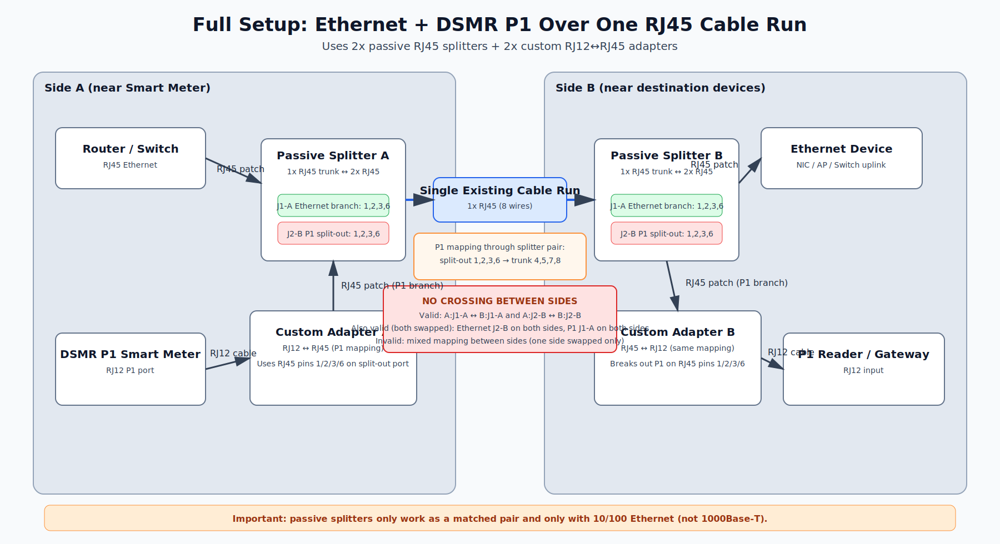
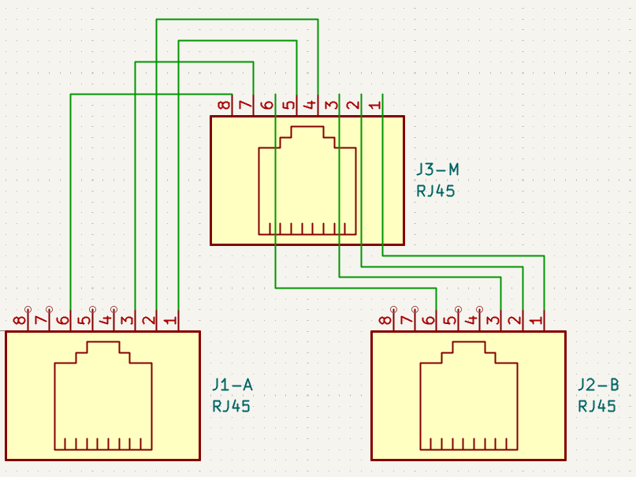
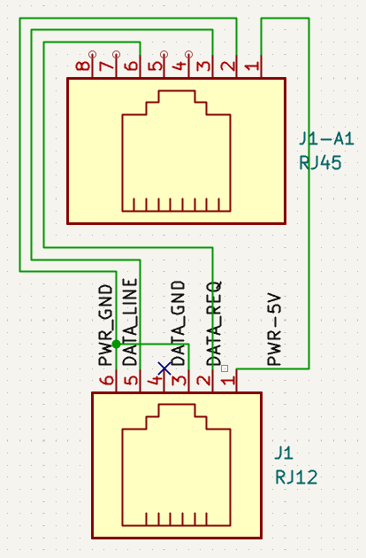

# rj45-split-45-12

Schematic-only KiCad project for combining Ethernet and DSMR P1 over a single cable run.

## Purpose

This project documents a passive wiring method where one physical RJ45 cable carries:

- 10/100 Mbps Ethernet
- DSMR P1 smart meter connection (via RJ12)

The setup uses:

- A standard passive RJ45 splitter at each end
- A custom RJ12 <-> RJ45 adapter at each end (before/after the splitters)

## Scope

- This repository contains a wiring schematic, not a PCB design.
- `rj45-split-45-12.kicad_pcb` is only an empty placeholder file.
- The relevant content is in `rj45-split-45-12.kicad_sch`.

## What Is Custom Here

- The custom part is the RJ12 <-> RJ45 wiring mapping used for the DSMR P1 path.
- The rest of the schematic content is included as reference context.

## Full Setup Diagram

## Port Pairing Rule (Critical)

- The two splitter ports must be used consistently end-to-end.
- If Ethernet is connected to `J1-A` and P1 adapter to `J2-B` on Side A, then on Side B it must also be Ethernet -> `J1-A` and P1 -> `J2-B`.
- You may swap both services to the other port set (Ethernet -> `J2-B`, P1 -> `J1-A`), but only if you do the same on both sides.
- Never cross them between sides (`J1-A` <-> `J2-B` mismatch). That is invalid wiring.

## Pinout Summary

### 1) Passive RJ45 Splitter (1x RJ45 <-> 2x RJ45)

For 10/100 Ethernet + P1 sharing on one cable:

- Ethernet branch uses pins `1,2,3,6`
- P1 split-out branch also presents pins `1,2,3,6` (mapped to trunk pins `4,5,7,8`)

| Trunk RJ45 Pin | Ethernet RJ45 Branch Pin | P1 Split-Out RJ45 Branch Pin |
|---|---|---|
| 1 | 1 | - |
| 2 | 2 | - |
| 3 | 3 | - |
| 4 | - | 1 |
| 5 | - | 2 |
| 6 | 6 | - |
| 7 | - | 3 |
| 8 | - | 6 |

### 2) RJ45 Ethernet (TIA-568B, 10/100Base-TX)

| RJ45 Pin | T568B Color | 10/100 Signal |
|---|---|---|
| 1 | White/Orange | TX+ |
| 2 | Orange | TX- |
| 3 | White/Green | RX+ |
| 4 | Blue | Unused in 10/100 |
| 5 | White/Blue | Unused in 10/100 |
| 6 | Green | RX- |
| 7 | White/Brown | Unused in 10/100 |
| 8 | Brown | Unused in 10/100 |

### 3) RJ12 DSMR P1 Port (6P6C)

| RJ12 Pin | P1 Signal |
|---|---|
| 1 | +5V |
| 2 | Data Request |
| 3 | Data GND |
| 4 | NC |
| 5 | Data |
| 6 | Power GND |

### 4) Custom RJ12 <-> RJ45 Adapter (This Project)

This custom mapping uses RJ45 pins `1,2,3,6` on the split-out P1 port.
Inside the splitter pair, these are transported over trunk pins `4,5,7,8`.

| RJ12 Pin | P1 Signal | RJ45 Pin (P1 Split-Out Port) | Trunk Pin Used Between Splitters |
|---|---|---|---|
| 1 | +5V | 3 | 7 |
| 2 | Data Request | 6 | 8 |
| 3 | Data GND | 2 | 5 |
| 4 | NC | - | - |
| 5 | Data | 1 | 4 |
| 6 | Power GND | 2 (tied with pin 3) | 5 |

## Files

- `rj45-split-45-12.kicad_sch`: Main wiring schematic.
- `rj45-split-45-12.kicad_pro`: KiCad project file.
- `rj45-split-45-12.kicad_prl`: Local KiCad preferences/state.
- `rj45-split-45-12-backups/`: KiCad backup archives.

## Open In KiCad

1. Open KiCad 9.
2. Open `rj45-split-45-12.kicad_pro`.
3. Inspect `rj45-split-45-12.kicad_sch`.

## Note

This is a reference wiring project only; no manufacturing outputs are included.

## Disclaimer

- This project is an experiment and is provided strictly for informational/reference purposes.
- No warranty is provided, express or implied.
- The author(s) accept no responsibility and no liability whatsoever for any damage, loss, malfunction, downtime, legal/compliance issues, or safety incidents resulting from use or misuse of this information.
- If you do not have the required electrical/networking knowledge, tools, and ability to validate wiring with proper testing equipment, do **not** use this design.
- Use at your own risk.
